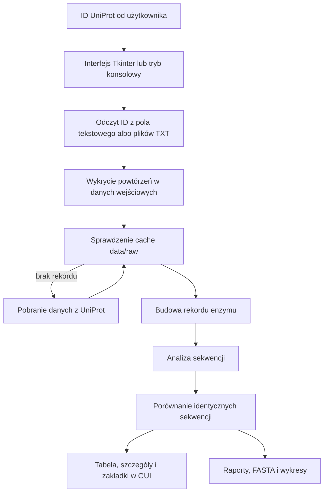

# UniProt Enzyme Explorer

UniProt Enzyme Explorer to aplikacja w Pythonie do pobierania, porównywania i eksportowania danych o enzymach na podstawie identyfikatorów UniProt. Program pozwala wkleić listę ID albo wczytać pliki `.txt`, pobiera rekordy z UniProt, analizuje sekwencje białkowe i pokazuje wyniki w interfejsie Tkinter.

Projekt ułatwia pracę z wieloma rekordami naraz: zamiast sprawdzać każdy wpis osobno, użytkownik dostaje jedną tabelę, szczegóły enzymu, informacje o duplikatach, sekwencje FASTA, raporty i wykresy.

## Najważniejsze funkcje

- pobieranie danych z UniProt i zapisywanie ich w lokalnym cache `data/raw`,
- wczytywanie ID z pola tekstowego albo z jednego lub kilku plików `.txt`,
- pomijanie pustych linii i komentarzy zaczynających się od `#`,
- wykrywanie powtórzonych ID w danych wejściowych,
- obliczanie parametrów sekwencji: długości, masy, udziału aminokwasów hydrofobowych i liczby cystein,
- wykrywanie rekordów z identyczną sekwencją białkową i wybór reprezentanta grupy,
- grupowanie rekordów według numeru EC,
- pobieranie sekwencji nukleotydowych, jeżeli rekord zawiera odnośnik EMBL/ENA albo RefSeq,
- podgląd szczegółów enzymu, interpretacji, duplikatów i sekwencji FASTA w GUI,
- eksport raportów CSV/XLSX, plików FASTA i wykresów PNG.

## Przepływ danych



## Struktura projektu

```txt
gui_main.py                              # uruchomienie aplikacji okienkowej
main.py                                  # opcjonalny tryb konsolowy
requirements.txt                         # wymagane biblioteki

src/uniprot_enzyme_explorer/
  pipeline.py                            # obsługa listy ID i uruchamianie analizy
  uniprot_client.py                      # komunikacja z UniProt, ENA/NCBI i cache
  analysis.py                            # statystyki sekwencji
  sequence_qc.py                         # duplikaty ID i identyczne sekwencje
  reports.py                             # eksport CSV/XLSX
  storage.py                             # zapis danych przetworzonych i FASTA
  charts.py                              # generowanie wykresów
  ui.py, ui_layout.py, ui_actions.py      # interfejs użytkownika
```

## Uruchomienie

1. Otwórz projekt w PyCharm.
2. Aktywuj środowisko `.venv`.
3. Zainstaluj zależności:

```bash
python -m pip install -r requirements.txt
```

4. Uruchom aplikację okienkową:

```bash
python gui_main.py
```

5. Wpisz identyfikatory UniProt ręcznie albo wczytaj plik `.txt`.
6. Kliknij przycisk pobierania i analizy danych.
7. Po zakończeniu analizy zapisz wybrane raporty, pliki FASTA lub wykresy.

Opcjonalnie można uruchomić tryb konsolowy:

```bash
python main.py
```

Ten tryb korzysta z pliku `data/input_ids.txt`, jeżeli jest dostępny.

## Format danych wejściowych

Identyfikatory UniProt mogą być oddzielone enterami, spacjami, przecinkami albo średnikami. Linie zaczynające się od `#` są traktowane jako komentarze.

Przykład:

```txt
P07327
P00326
P07327

# komentarz zostanie pominięty
P11766
```

## Pliki tworzone przez aplikację

Aplikacja zapisuje pobrane rekordy w cache, dzięki czemu kolejne użycie tych samych ID jest szybsze. Po analizie można też utworzyć raporty, pliki FASTA i wykresy.

```txt
data/
  raw/
    P07327.json                         # przykładowy rekord UniProt zapisany w cache
    nucleotide/                         # cache sekwencji nukleotydowych FASTA
  processed/
    enzyme_records.json                 # ostatnio przetworzone rekordy z GUI

outputs/
  reports/
    enzyme_report.csv                   # raport CSV z trybu konsolowego
    enzyme_report.xlsx                  # raport Excel z trybu konsolowego
  fasta/
    wszystkie_sekwencje_aminokwasowe.fasta
    reprezentatywne_sekwencje_aminokwasowe.fasta
    wszystkie_sekwencje_nukleotydowe.fasta
    reprezentatywne_sekwencje_nukleotydowe.fasta
  charts/
    sequence_lengths.png
    molecular_weights.png
    cysteine_counts.png
    hydrophobic_percent.png
    ec_classes.png
```

W GUI użytkownik wybiera miejsce zapisu raportów, FASTA i wykresów w oknie dialogowym.

## Wykorzystanie narzędzi sztucznej inteligencji

W trakcie pracy korzystano pomocniczo z narzędzi ChatGPT i Codex. Pomagały one przy pisaniu i poprawianiu kodu, porządkowaniu struktury projektu, szukaniu błędów, testowaniu wybranych funkcji oraz przygotowaniu dokumentacji.

AI nie jest częścią działania aplikacji. Program pobiera dane z UniProt albo z lokalnego cache, a wyniki analizy są obliczane przez kod projektu.
